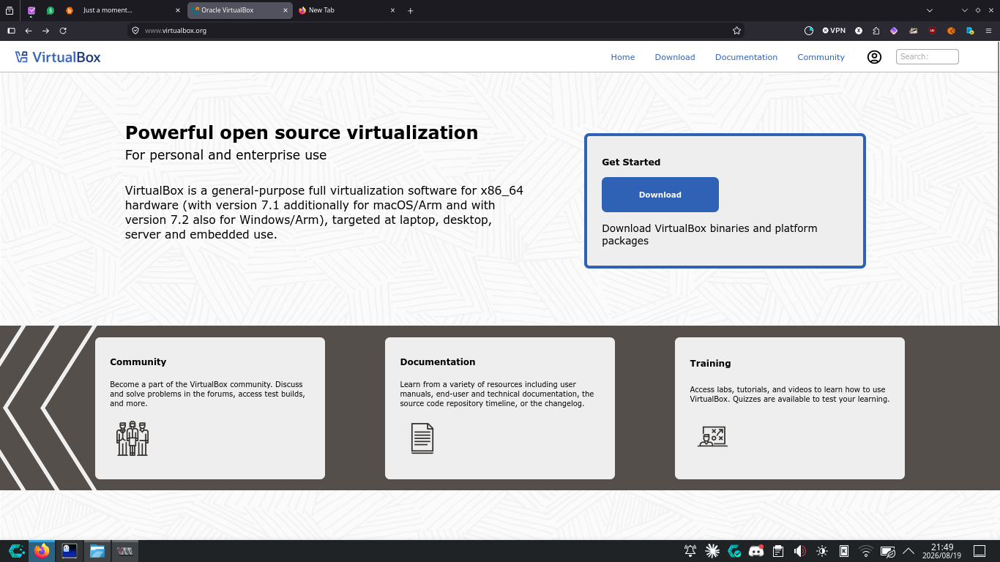
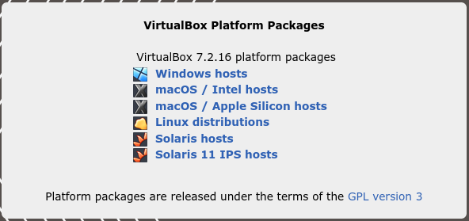

### Requirements

→ VirtualBox

→ Red Hat Enterprise Linux

### Install VirtualBox

#### Follow these installation steps

```
1. Open your browser and search virtualbox.
```

```
2. Navigate to the downloads page by clicking on the "Download” button.
```



```
3. Choose "Window hosts" from the "VirtualBox Platform Packages".
```



```
4. This will download the .exe and the installation process will be easy to follow from there.
```


```
5. The windows administrator will send you a prompt, asking whether you would like the application to make changes on your device, Select “Yes”.
```

